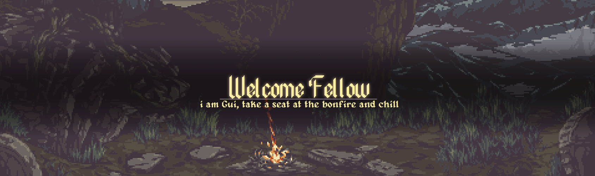
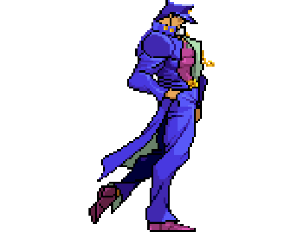
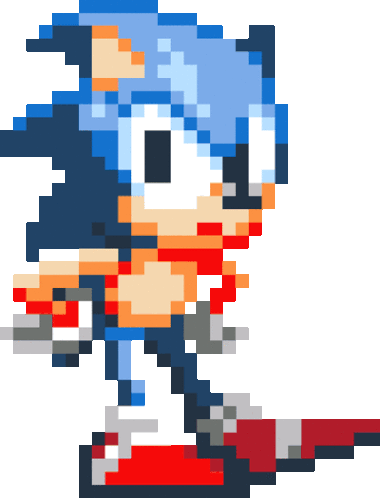

<h1 align="center"> 𝓗𝓮𝓵𝓵𝓸 𝓽𝓱𝓮𝓻𝓮!
   
  <a href="mailto:guiloliveira343@gmail.com">
   
<a/>
  

</h1>

  <em>
    My name is <b>Guilherme</b>, but you can call me <b>Guil</b>! I've had a passion for technology from an early age, which led me to pursue a degree in <b>Computer Networks</b> during high school and later, <b>Information Systems</b> in college. I love solving problems with <b>creative</b> solutions!
  </em> 
  

    
    <h2><em> I hope you like my little corner <3 </em> </h2>
    

    
    <h3 style="margin-right: 20px;">About me:</h3>
    

  

  • I'm passionate about video games. I also enjoy watching anime and movies, studying game development, and creative programming 🤓. 
  • Currently, I'm engaged in college, but in my free time, I enjoy testing new languages and libraries 🥳. 
  • Now I'm studying C# and Express.js 🧐. 
  • Thinking about Godot and Rust 🤔... 
  • Looking for help in .NET 😅. 
  • I would like to participate in any project that looks fun and creative 😊. 
  • Trying to be a software engineer and a game developer 😄.

